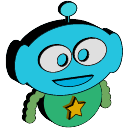
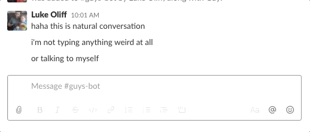

# Simple Guys Bot



If you're as concious as I am about the use of language in your Slack workspace, this will interest you.

With the existing [guys-bot-for-slack](https://glitch.com/~guys-bot-for-slack) needing some updates to work with the latest flavour of Slack API, I chose to recreate it using the most basic implementation of the Slack SDKs.



The bot responds with an ephemeral message, not seen by anyone but the user who originally messaged.

It requires the bot be invited into the channels you want it to listen on, so it can be implemented by individuals, or teams, as channels require, if that is what you want.

## Installation

Get the repo.

```shell
git clone https://github.com/lukeocodes/guys-bot.git
cd guys-bot
```

Install it.

```shell
npm install
```

## Running it in Development Mode

### Configuration

```shell
cp .env.example .env
```

Edit `.env` with your Slack Token (the Bot Access Token) and App Signing Secret, plus a URL for a document that explains your etiquette, inclusion, and diversity policy.

### Run Dev

```shell
npm run dev
```

## Deploying it to Production

### To Start It

```shell
npm start
```

### Click to Deploy Options

<!-- [](https://heroku.com/deploy) -->
<!-- [](https://deploy.cloud.run) -->


## Logo

Guy - whos a good bot - is saved as SVG and is subject to the same license for the project. Enjoy :)